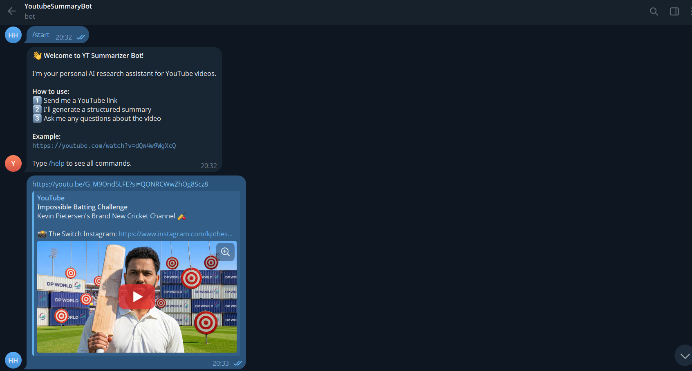
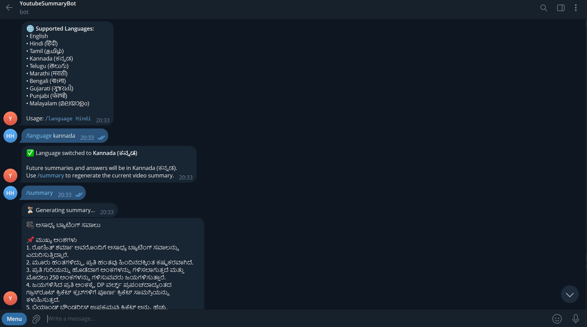

# 🎬 YT Summarizer Bot

A Telegram bot that **summarizes YouTube videos** and lets you ask questions about them — powered by **Groq** (llama-3.3-70b) or **Google Gemini** AI, with transcript caching, multi-language support, and an **OpenClaw skill** integration.

---

## 📸 Demo

### Summary output


### Q&A in action


### Full walkthrough (video)


---

## ✨ Features

| Feature | Details |
|---|---|
| 📺 **YouTube Summarization** | Structured summary: Key Points, Timestamps, Core Takeaway |
| 💬 **Contextual Q&A** | Ask any question; answers grounded in the transcript |
| 🌐 **Multi-Language** | English + Hindi, Tamil, Kannada, Telugu, Marathi, Bengali, and more |
| ⚡ **Transcript Caching** | Same video shared across users — fetched only once (TTL-based) |
| 🤖 **Dual AI Provider** | Groq (free, fast) as primary; Gemini as fallback — auto-switched |
| 🔌 **OpenClaw Skill** | Registered as an OpenClaw skill via `skill.json` + HTTP endpoint |
| 🧹 **Commands** | `/summary`, `/deepdive`, `/actionpoints`, `/language`, `/clear` |

---

## 🚀 Quick Setup

### Prerequisites

- Python 3.11+
- A **Telegram Bot Token** → Get from [@BotFather](https://t.me/BotFather) (`/newbot`)
- **At least one AI API key** (Groq recommended — free and generous limits):
  - 🟢 **Groq** → [console.groq.com](https://console.groq.com) — free, 30 RPM, 14,400 req/day
  - 🔵 **Gemini** → [aistudio.google.com/app/apikey](https://aistudio.google.com/app/apikey) — free, 15 RPM

---

### Step 1 — Clone & Install

```bash
git clone <repo-url>
cd yt-summarizer-bot

python -m venv .venv
source .venv/bin/activate      # Windows: .venv\Scripts\activate
pip install -r requirements.txt
```

### Step 2 — Configure Environment

```bash
cp .env.example .env
nano .env   # or open in any editor
```

**Minimum required config:**

```env
# Required — from @BotFather
TELEGRAM_BOT_TOKEN=123456:ABC-your-token-here

# At least ONE of these AI keys must be set
GROQ_API_KEY=gsk_xxxxxxxxxxxxxxxxxxxxxxxx      # recommended
# GEMINI_API_KEY=AIzaSy-your-key-here          # optional fallback
```

> **Note:** If `api.telegram.org` is blocked on your network, see the [Local Telegram Server](#-blocked-network--local-telegram-server) section below.

### Step 3 — Run

```bash
python bot.py
```

Bot starts polling for messages. The OpenClaw skill HTTP endpoint also starts on port `8080`.

---

## 💬 Usage

### Send a YouTube link

```
https://youtube.com/watch?v=dQw4w9WgXcQ
```

Bot replies with a structured summary:

```
🎥 Never Gonna Give You Up

📌 Key Points
1. Classic pop anthem from the 80s
2. Rick Astley's breakthrough hit
...

⏱ Important Timestamps
• 00:18 — Verse begins
• 01:05 — Chorus

🧠 Core Takeaway
A timeless declaration of unconditional commitment.
```

### Ask follow-up questions

```
User: What does he say about trust?
Bot:  Around 0:18, the lyrics express never wanting to let the other person down...
```

### Switch output language

```
/language Hindi
```

or naturally in a message:

```
Summarize in Tamil
```

---

## 📋 Commands

| Command | Description |
|---|---|
| `/start` | Welcome message and quick guide |
| `/help` | Full command reference |
| `/summary` | Re-display the video summary |
| `/deepdive` | In-depth analysis with expanded context |
| `/actionpoints` | Extract actionable takeaways from the video |
| `/language [name]` | Switch output language (e.g. `/language Hindi`) |
| `/clear` | Clear session and start fresh |

---

## 🌍 Supported Languages

English (default) · Hindi · Tamil · Kannada · Telugu · Marathi · Bengali · Gujarati · Punjabi · Malayalam

The AI generates responses natively in the target language — no separate translation step.

---

## 🏗️ Architecture

```
User (Telegram)
      │
      ▼
python-telegram-bot  (long polling)
      │
      ├── YouTube URL detected?
      │         │
      │         ▼
      │   Transcript Validator  ──► invalid URL → ignored
      │         │
      │         ▼
      │   Transcript Cache (TTLCache)
      │     HIT ──────────────────────────────────────────┐
      │     MISS                                           │
      │         │                                         │
      │         ▼                                         │
      │   YouTube Transcript API (v1.x)                   │
      │     ├── fetch preferred langs (en/en-US/en-IN)    │
      │     └── fallback: any available language          │
      │         │                                         │
      │         ▼                                         │
      │   Session Manager  ◄──────────────────────────────┘
      │   (per-user: video_id, transcript, summary, lang, qa_history)
      │         │
      │         ▼
      │   AI Client  (provider waterfall)
      │     1. Groq  → llama-3.3-70b-versatile
      │               → llama-3.1-8b-instant  (fallback)
      │               → mixtral-8x7b-32768   (fallback)
      │     2. Gemini → gemini-2.0-flash-lite
      │               → gemini-2.0-flash     (fallback)
      │               → gemini-2.5-flash     (fallback)
      │     (auto-fallback on 429 quota / 404 model errors)
      │         │
      │         ▼
      │   Structured Summary ──► User
      │
      └── Question asked? (active video session)
                │
                ▼
          Q&A Engine (last 10 turns of history)
                │
                ▼
          Answer ──► User
```

### Module Map

```
yt-summarizer-bot/
├── bot.py                       # Entry point + handler registration
├── config.py                    # All settings loaded from .env
├── skill.json                   # OpenClaw skill manifest
├── docker-compose.yml           # Local Telegram Bot API server
├── requirements.txt
├── .env.example
│
├── src/
│   ├── transcript/
│   │   ├── validator.py         # YouTube URL parsing (5 URL patterns)
│   │   ├── fetcher.py           # Transcript fetching, language fallback, retries
│   │   └── chunker.py           # Long transcript splitting for LLM context
│   │
│   ├── ai/
│   │   ├── client.py            # Dual-provider AI client (Groq + Gemini)
│   │   ├── prompts.py           # Prompt templates + language map
│   │   ├── summarizer.py        # Summary / deep-dive / action points
│   │   └── qa.py                # Q&A with conversation history
│   │
│   ├── session/
│   │   └── manager.py           # Per-user state + shared transcript TTL cache
│   │
│   └── handlers/
│       ├── commands.py          # /start /help /summary /deepdive /actionpoints /language /clear
│       └── messages.py          # URL detection router + Q&A fallback
│
└── tests/
    ├── conftest.py
    ├── test_validator.py
    ├── test_chunker.py
    └── test_summarizer.py
```

---

## ⚖️ Design Trade-offs

| Decision | Choice Made | Alternative Considered | Rationale |
|---|---|---|---|
| **AI Provider** | Groq (primary) + Gemini (fallback) | Single provider | Groq's free tier is 10× more generous than Gemini's; auto-fallback ensures resilience |
| **Bot framework** | `python-telegram-bot` async | `aiogram`, `pyTelegramBotAPI` | Best docs, active maintenance, built-in rate limiting + retry |
| **Polling vs Webhook** | Long polling | Webhook | No public URL needed for local dev; trivially switchable for production via `ApplicationBuilder` |
| **Session storage** | In-memory dict | Redis / SQLite | Zero infrastructure for MVP; trade-off is sessions lost on restart |
| **Transcript cache** | `cachetools.TTLCache` (shared) | Per-user cache | Multiple users requesting the same video share one fetch; TTL prevents stale data |
| **Token efficiency** | 200k char cap, first+last half | Send full transcript | Avoids hitting context limits on very long videos; first+last covers intro and conclusion |
| **Summary caching** | Cached per user+video | Regenerate every time | Saves API quota for repeated `/summary` calls; invalidated on language change |
| **Language handling** | Prompt-level instruction to LLM | Separate translation API | LLM-native generation produces more natural output than post-translation |
| **Multi-model fallback** | Waterfall (lite → standard → pro) | Single model | Grade failures (quota, model removed) gracefully without user interruption |
| **System prompt in v1 API** | First conversation turn | `systemInstruction` field | Google's v1 REST API removed `systemInstruction`; multi-turn workaround is spec-compliant |

---

## ⚠️ Edge Cases Handled

| Scenario | Handling |
|---|---|
| Invalid / non-YouTube URL | `validator.py` regex — silently ignored, bot goes to Q&A or prompts for a link |
| No transcript available | `fetcher.py` catches `NoTranscriptFound` → user-friendly error message |
| Transcripts disabled | `TranscriptsDisabled` exception → specific error to user |
| Private / unavailable video | `VideoUnavailable` exception → specific error to user |
| Non-English video | 4-level fallback: preferred langs → manual → auto-generated → any available |
| Very long video (3h+) | 200k char cap with first+last coverage to preserve intro and conclusion context |
| YouTube rate limiting | Exponential backoff (3 retries: 2s, 4s, 8s) in `fetcher.py` |
| AI quota exhausted | Auto-fallback to next model in waterfall; switches between providers (Groq → Gemini) |
| Question not in video | AI instructed to say "not covered in the video" rather than hallucinate |
| No video loaded yet | Prompts user to send a YouTube link first |
| Multiple users simultaneously | Fully isolated sessions per Telegram user ID |

---

## 🔌 OpenClaw Integration

The bot registers as an **OpenClaw skill**:

- **`skill.json`** — manifest declaring triggers, capabilities, and command descriptions
- **`POST /openclaw/skill`** (port `8080`) — HTTP endpoint OpenClaw forwards matched messages to

### Connecting

```bash
npm install -g openclaw@latest
cp skill.json path/to/openclaw/skills/
openclaw onboard
```

OpenClaw gateway matches messages and routes them to this bot's skill endpoint.

---

## 🚧 Blocked Network — Local Telegram Server

If `api.telegram.org` is blocked on your network:

**1. Get API credentials** from [my.telegram.org/apps](https://my.telegram.org/apps):

```env
TELEGRAM_API_ID=12345678
TELEGRAM_API_HASH=abcdef1234567890abcdef1234567890
LOCAL_BOT_API_SERVER_URL=http://localhost:8081
```

**2. Start the local Telegram Bot API server:**

```bash
docker compose up -d telegram-bot-api
```

The bot will automatically connect via `http://localhost:8081` instead of `api.telegram.org`.

---

## 🧪 Testing

```bash
# All tests (44 tests)
python -m pytest tests/ -v

# Specific modules
python -m pytest tests/test_validator.py -v    # URL parsing
python -m pytest tests/test_chunker.py -v     # Transcript splitting
python -m pytest tests/test_summarizer.py -v  # Summary logic
```

All external API calls are mocked — tests run offline without any API keys.

---

## ⚙️ Configuration Reference

All settings are loaded from `.env`. See `.env.example` for full documentation.

| Variable | Required | Default | Description |
|---|---|---|---|
| `TELEGRAM_BOT_TOKEN` | ✅ | — | From @BotFather |
| `GROQ_API_KEY` | ⚠️ one required | — | From console.groq.com |
| `GEMINI_API_KEY` | ⚠️ one required | — | From aistudio.google.com |
| `LOCAL_BOT_API_SERVER_URL` | ❌ | — | URL of local Telegram server |
| `TELEGRAM_API_ID` | ❌ | — | Required for local server |
| `TELEGRAM_API_HASH` | ❌ | — | Required for local server |
| `LOG_LEVEL` | ❌ | `INFO` | Python log level |
| `MAX_CACHE_SIZE` | ❌ | `100` | Max transcripts in cache |
| `CACHE_TTL_SECONDS` | ❌ | `3600` | Transcript cache lifetime (1 hour) |
| `MAX_QA_HISTORY` | ❌ | `10` | Q&A turns to keep per session |
| `OPENCLAW_SKILL_PORT` | ❌ | `8080` | Port for the skill HTTP endpoint |

---

## 📄 License

MIT License — see [LICENSE](LICENSE).
